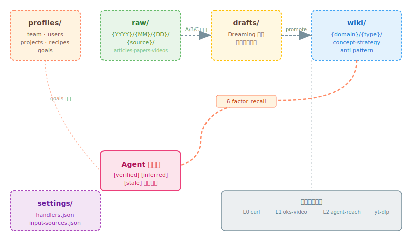

# Architecture（架构）

*4 认知桶 + 2 基础设施层、记忆生命周期与设计原则。*

## Raw Material vs Memory — 核心区分

| | Raw Material（raw/） | Memory（wiki/） |
|---|---|---|
| **是什么** | 原始文章、论文、仓库笔记或对话 | 持久的结论，经过蒸馏和策划 |
| **谁写入** | 人类收集，LLM 只读 | LLM 通过 Dreaming 写入，人类审批 |
| **衰减** | 无 — raw materials 永久保留 | 类型特定 λ — 知识随时间衰减 |
| **召回** | 关键词 + 新鲜度 | 6 因子相关性 + 记忆曲线 |
| **优势** | 日期 + 来源分类、A/B/C 分级、指纹去重 | 22 域结构、衰减 tier、4 种知识关系 |
| **何时用** | 需要完整历史或精确来源 | 需要模式、决策或教训 |

推荐工作流：将来源保存到 `raw/`，然后将有价值的部分蒸馏为 `wiki/` memory。

## 4 认知桶 + 2 基础设施层



四个**认知桶**是 Agent 观察、写入、召回、遗忘的知识；两个**基础设施层**（配置 + schema）是 Agent 读取来决定"怎么运转"、但从不作为知识写入的东西 —— 它们不衰减、不按相关性召回。

| 层 | 目录 | 用途 | 衰减 | 访问 |
|----|------|------|------|------|
| 认知 | `profiles/` | 团队、用户、项目画像 | 无 | 直接读取 |
| 认知 | `raw/` | Raw materials（原始材料） | 无 | 关键词 + 新鲜度 |
| 认知 | `wiki/` | 策划知识（memories） | 类型特定 λ | 6 因子召回 |
| 认知 | `drafts/` | Dreaming 候选 | 无 | N/A（人工审查） |
| 配置 | `settings/` | 运行时旋钮：路由表、衰减、intake | 无 | 直接读取（运行时读路由表） |
| Schema | `_meta/` | 数据形状契约：frontmatter/learning | 无 | 读时应用；CI 强制 |

## 目录结构

```
open-knowledge-studio/
├── profiles/          # ① 画像
│   ├── team.md
│   ├── users/{id}.md
│   ├── projects/{slug}.md
│   ├── recipes/{slug}.md     # 自动化配方
│   └── goals/{slug}.md       # 目标（影响召回）
├── raw/               # ② Raw materials
│   └── {YYYY}/{MM}/{DD}/{source}/   # articles|papers|videos|audio|repos|misc
├── wiki/              # ③ 策展知识
│   └── {domain}/{type}/{slug}.md
├── drafts/            # ④ Dreaming 候选
├── settings/          # ⑤ 配置层
│   ├── handlers.json          # 三级工具注册表
│   └── input-sources.json
└── _meta/             # ⑥ Schema 层
    ├── frontmatter-schema.md  # wiki/ frontmatter 契约
    └── learning-schema.json   # CI 强制的 learning schema
```

**基础设施（非桶）**：`cli/`（API-free 的 `oks` 核心）、`templates/`、`docs/` 同样位于顶层，但装的是代码/文档，不是知识。

## 22 个知识域

management, transport, finance, production, computing, repair, engineering, construction, science, agriculture, social, administration, legal, sales, education, personal, media, healthcare, care, maintenance, food, security

每个域有三个子目录：`concepts/`、`strategies/`、`anti-patterns/`。

## 记忆生命周期

```
Observe → Write → Store → Retrieve → Inject → Forget
```

1. **Observe（观察）** — 对话、工具结果、trace、反馈
2. **Decide to write（决定写入）** — 高置信度、可复用、有来源标注
3. **Store（存储）** — 按类型写入对应桶
4. **Retrieve（检索）** — 先 scope（workspace → topic → goal → time），再关键词搜索
5. **Inject（注入）** — 分层注入，稳定层在前（KV Cache 友好），带来源标签
6. **Update/Forget（更新/遗忘）** — 标记 stale，重新评分，归档

## Wiki 页面生命周期

```
Provisional → Active（access_count ≥ 3）→ Dropped（score < threshold）
                                         → Superseded（被新页面替代）
```

### 知识演化关系

当新知识与已有知识产生关联时，系统追踪四种关系：

| 关系 | 含义 | 对旧页面的影响 |
|------|------|-----------------|
| `supersedes` | 新页面替代旧页面 | 标记 `superseded`，从召回中排除 |
| `enriches` | 新页面补充旧页面 | 两者保持 active，互相链接 |
| `confirms` | 新页面验证旧页面 | 旧页面 confidence 提升 |
| `challenges` | 新页面与旧页面矛盾 | 旧页面标记 `[stale]` 待复查 |

### Working Memory — 每日简报（规划中）

每天，Studio 可以从近期和高重要性的 memories 中生成一份简报。这份工作记忆文件为 Agent 提供关于你当前工作的上下文 — 在你说任何话之前。

## 设计原则

- **Git IS the migration** — 无数据库，schema 变更通过 `_meta/` 版本化
- **Atomic writes** — 所有持久化写入使用 `mkstemp + fsync + os.replace`
- **Human-gated** — 系统绝不未经人工审查就将 raw 内容提升到 wiki
- **No AI configuration** — Agent 是 AI 引擎，CLI 只负责文件操作 + 召回评分

## 下一步

* **[召回引擎](recall-engine.md)**：6 因子评分算法
* **[记忆模型](memory-model.md)**：六型记忆与注入顺序
* **[Dreaming 循环](dreaming-cycle.md)**：知识演化管线

---


