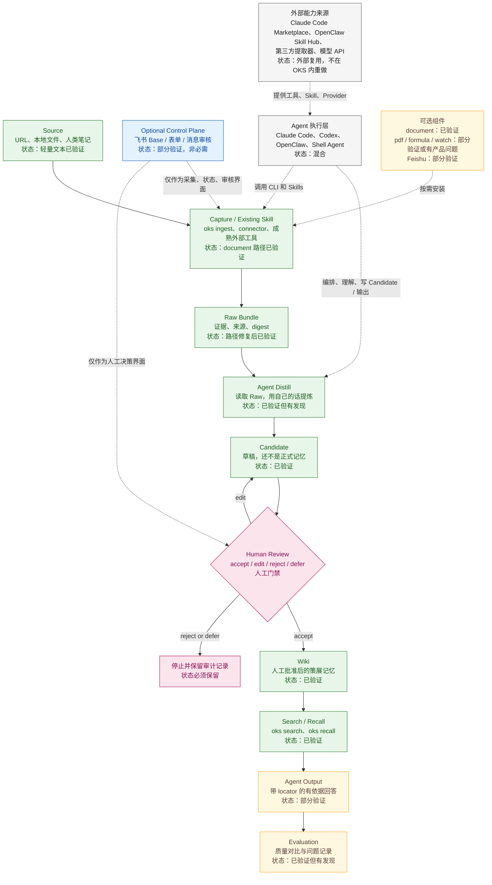

# OKS 核心架构

日期：2026-07-30

本页是当前 OKS 架构的主事实源。它必须区分三件事：设计上存在、代码中实现、真实环境验证通过。不要把三者混成“全部可用”。

## 主闭环

读者一分钟内应该先看懂这条线：

`Source -> Capture / Existing Skill -> Raw Bundle -> Agent Distill -> Candidate -> Human Review -> Wiki -> Search / Recall -> Agent Output -> Evaluation`

## 状态说明

| 状态 | 含义 |
|---|---|
| `已验证` | 代码路径已经在真实本地或远端环境跑过。 |
| `已验证但有发现` | 闭环可用，但报告记录了产品问题、追溯问题或操作摩擦。 |
| `部分验证` | 某些子路径可用，但完整能力声明还没有被证明。 |
| `尚未验证` | 可能有设计或代码，但没有合格运行证据。 |
| `人工门禁` | 系统必须停下等待明确人工审核，不能自动继续。 |

## 什么是核心

OKS 的核心是可审计的知识生命周期：

- Source、Raw、Candidate、Review、Wiki、Recall、Output、Evaluation 必须是分离状态；
- Raw Bundle 必须写入当前隔离知识库；
- Wiki 晋升前必须有人类明确批准；
- CLI 必须提供 `search`、`recall`、`drafts`、`lint` 等生命周期能力；
- `failed`、`partial`、`skipped`、`environment_limited` 等状态必须保留。

OKS 的核心声明不是“能提取所有媒体类型”，而是“知识可以经过可追溯、有人类门禁的闭环沉淀为可召回记忆”。

## 什么是可选

飞书是可选私有控制面。它可以提供 Base、表单、消息审核等入口，用来承载采集、状态和人工审核，但它不是非飞书 CLI 闭环的必要条件。

Claude Code Marketplace、OpenClaw Skill Hub、浏览器工具、模型 API、OCR/ASR 引擎、文档/视频提取器都是外部能力来源。OKS 应该在需要时调用或复用它们，而不是把它们重新实现成内部平台模块。

## 当前证据

| 能力 | 当前状态 | 证据 |
|---|---|---|
| 轻量文本核心闭环 | `已验证但有发现` | `docs/acceptance/clean-server-deployment-report.md` |
| 干净服务器部署提示词 | `passed_with_findings` | `docs/acceptance/clean-server-deployment-report.md` |
| `document` 能力 | `已验证` | 远端干净服务器 document 安装与 ingest |
| Raw 路径隔离 | `修复后已验证` | clean-server 报告、Raw location assertion |
| Agent 最终回答 locator 纪律 | `部分验证` | B 组质量提升，但首次未满足严格 locator 阈值 |
| 飞书控制面 | `部分验证` | `docs/acceptance/feishu-e2e-status.md` |
| PDF / formula / watch | `部分验证 / 有产品问题` | 组件验收报告与后续修复清单 |
| OpenClaw 自主执行提示词 | `尚未验证` | 最终探测时 gateway 不可达 |

## 架构规则

OKS 应该做：

- 保留完整证据和状态；
- 可选提取器按需安装；
- 暴露清晰 CLI 和 Agent 可读提示词；
- 复用现有 Skill、插件和外部工具；
- 让 Agent 输出能引用 Recall 提供的 locator。

OKS 不应该做：

- 把飞书当成必需基础设施；
- 未经人工审核把 Raw 静默晋升为 Wiki；
- 隐藏缺二进制、下载失败、平台反爬或模型限制；
- 把未验证模块画成已经通过；
- 在第一个闭环不需要的情况下建设插件市场、Skill Hub、Agent 框架、队列系统或分布式 Worker。
