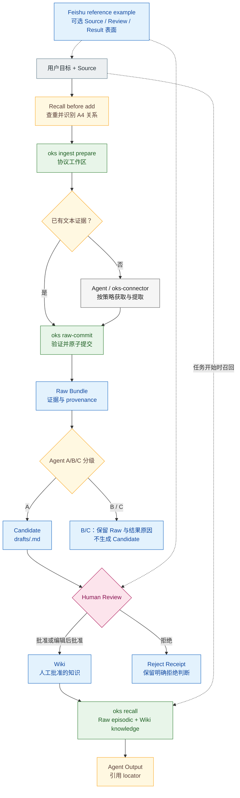

# OKS 核心架构

本页描述当前职责边界；具体命令以 `oks --help` 为准，架构不变量以
[`CONSTITUTION.md`](https://github.com/open-agent-power/open-knowledge-studio/blob/main/CONSTITUTION.md)
为准。Provider 数量和环境可用性属于运行时信息，请用
`oks capability status --json` 查看，不写死在架构图里。

## 主闭环

读者一分钟内应该先看懂这条线：

`Recall before add -> Raw evidence -> A/B/C -> Candidate -> Human Review -> Wiki -> Recall`

图只表达职责和状态转换，不表达某个版本的验收结论。特定环境的测试与验收证据
保存在 `records/`，避免把历史快照误读为当前能力承诺。

## 什么是核心

OKS 的核心是可审计的知识生命周期：

- Source、提取执行、Raw Bundle、Candidate、Review、Wiki、Recall 与 Output 必须是分离状态；
- Raw Bundle 通过 `oks raw-commit` 做 Schema、交叉引用、artifact、locator 与 provenance 校验，并原子提交；
- Skill 通过 `assets/` 作为唯一事实源安装（`_materialize_assets()` 按 `_AGENT_TARGETS` 装配）；
- Wiki 晋升前必须有人类明确批准；
- CLI 必须提供 `recall`、`raw-commit`、`init --upgrade`、`capability` 等生命周期能力；`recall` 是唯一召回入口；
- `failed`、`partial`、`skipped`、`environment_limited` 等状态必须保留。

OKS 的核心声明不是”能提取所有媒体类型”，而是”知识可以经过可追溯、有人类门禁的闭环沉淀为可召回记忆”。

## 什么是可选

飞书是已迁出 Core 的参考实现。`examples/feishu-loop/` 演示 Base、表单和消息审核如何承载采集、状态和人工审核；它不随 `oks` CLI 分发，Core 也不 import 它。

Claude Code Marketplace、OpenClaw Skill Hub、浏览器工具、模型 API、OCR/ASR 引擎、文档/视频提取器都是外部能力来源。OKS 应该在需要时调用或复用它们，而不是把它们重新实现成内部平台模块。

## 当前边界

| 主题 | 当前边界 |
|------|----------|
| 包边界 | Core 包为 `knowledge_studio`；采集执行由依赖包 `oks-connector` 提供 |
| 摄入入口 | Agent `/ingest`，或 CLI 的 `oks ingest prepare` / `oks ingest run` |
| 召回入口 | 仅 `oks recall` |
| Skill 安装源 | `assets/` 是安装到各 Agent host 的 canonical 源 |
| 提交安全 | 校验失败即拒绝；最终写入使用原子替换/移动 |
| Provider 发现 | 包内 `knowledge_studio/providers/<id>/provider.yaml`；数量以运行时状态为准 |
| 远程处理 | URL 可访问不等于允许上传；`ask` 必须在远程处理前由用户决策 |
| 审核 | Promote 必须有人类批准；Reject 写 receipt，不把拒绝伪装成遗忘 |
| 飞书 | 仅 `examples/feishu-loop/` 参考实现，不随 Core CLI 分发 |
| 导出 | `oks wiki export` 生成单向快照，不提供双向同步 |

## 架构规则

OKS 应该做：

- 保留完整证据和状态；
- 可选提取器按需安装；
- 暴露清晰 CLI 和 Agent 可读提示词；
- 复用现有 Skill、插件和外部工具；
- 让 Agent 输出能引用 Recall 提供的 locator。

OKS 不应该做：

- 把飞书当成必需基础设施；
- 未经人工审核把 Raw 静默晋升为 Wiki；
- 隐藏缺二进制、下载失败、平台反爬或模型限制；
- 把未验证模块画成已经通过；
- 在第一个闭环不需要的情况下建设插件市场、Skill Hub、Agent 框架、队列系统或分布式 Worker。
