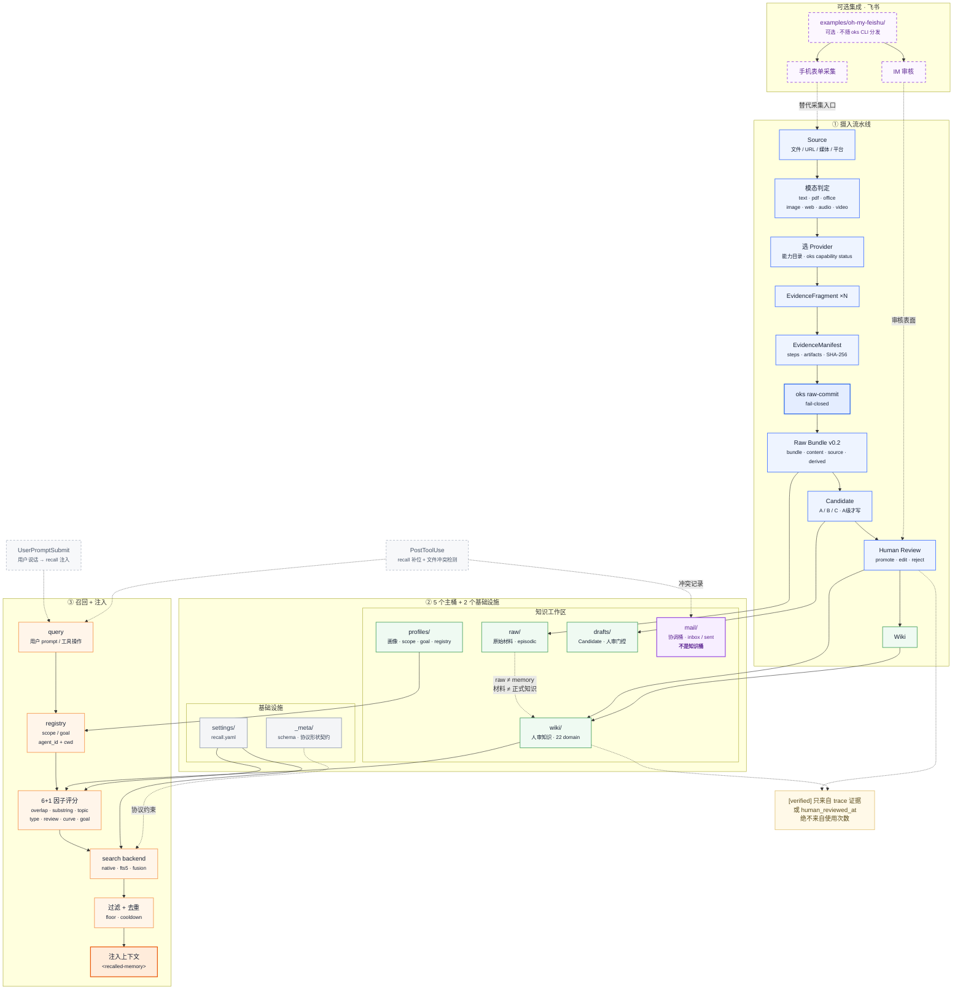

# 架构总览

OKS 三层架构：**摄入 → 桶 → 召回**，两条 hook 是可选注入入口；飞书是可选集成，不随 `oks` CLI 分发。

## 关键点

- **摄入 fail-closed**：Schema + provenance + SHA-256 校验，证据不足即拒；raw ≠ memory，材料≠正式知识。
- **7 桶**：profiles / raw / wiki / drafts / mail（5 认知）+ settings / _meta（2 基础设施）；`mail` 是协调桶，不是知识桶。
- **召回**：6+1 因子 + 可插拔 backend（native / fts5 / fusion），floor + cooldown 过滤去重后注入 `<recalled-memory>`。
- **Hooks（可选注入）**：UserPromptSubmit（用户 prompt → recall 注入）+ PostToolUse（recall 补位 + 文件冲突检测），`oks hook install` 显式安装。
- **信任语义**：`[verified]` 只来自 trace 证据或 `human_reviewed_at`，绝不来自使用次数。
- **飞书**：可选参考集成（`examples/oh-my-feishu/`），提供手机表单采集 + IM 审核的替代前端，不随 `oks` CLI 分发。
