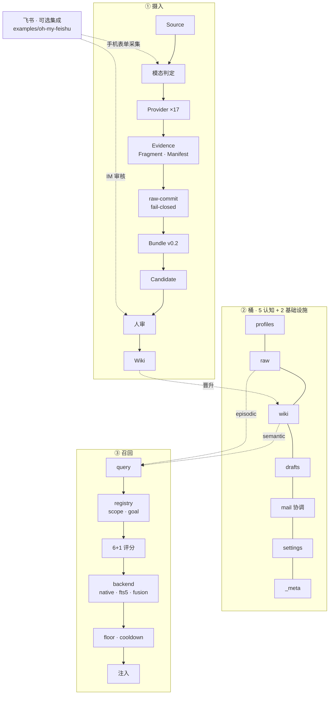

# 架构总览

OKS 三层架构：**摄入 → 桶 → 召回**。飞书是可选集成，不随 `oks` CLI 分发。

## 关键点

- **摄入 fail-closed**：Schema + provenance + SHA-256 校验，证据不足即拒。
- **7 桶**：profiles / raw / wiki / drafts / mail（5 认知）+ settings / _meta（2 基础设施）；`mail` 是协调桶，不是知识桶。
- **召回**：6+1 因子 + 可插拔 backend（native / fts5 / fusion）。
- **飞书**：可选参考集成（`examples/oh-my-feishu/`），提供手机表单采集 + IM 审核的替代前端，不随 `oks` CLI 分发。
