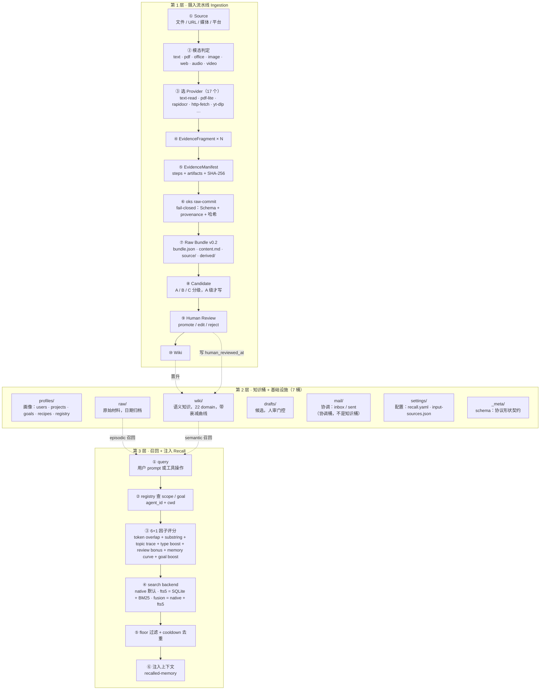

# 架构总览

OKS 三层架构：**摄入流水线 → 知识桶 → 召回注入**。

## 关键约束

- 摄入 **fail-closed**：Schema + provenance + SHA-256 校验，证据不足即拒绝，不把「Agent 自称存了」当证据。
- 信任语义：`[verified]` 只来自 trace 证据或 `human_reviewed_at`（人审时间戳），绝不来自使用次数。
- 两条 hook：`UserPromptSubmit`（用户说话 → recall 注入）与 `PostToolUse`（工具调用 → recall 补位 + 文件冲突检测，写 mail/）。
