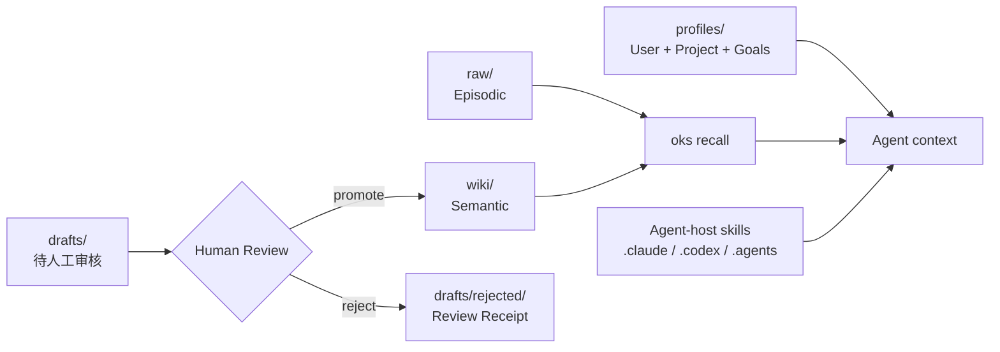

# 记忆模型

*六型记忆、注入顺序（稳定层在前）、来源标签与冲突优先级。*

## 记忆类型



| 类型 | 存储 | 召回 | 衰减 | Scope |
|------|------|------|------|-------|
| User Memory | `profiles/users/{id}/profile.md` | 需 `--user {id}` | 无 | `user_id` |
| Project Memory | `profiles/projects/{slug}.md` | 需 `--project {slug}` | 无 | `project_slug` |
| Episodic Memory | `raw/{YYYY}/{MM}/{DD}/{source}/` | 关键词 + 新鲜度 | 无 | `source`、`date` |
| Semantic Memory | `wiki/{domain}/{type}/` | 6+1 因子 + 曲线 | 类型 λ | `domain` |
| Procedural Memory | Agent host 的 skills 目录 | 由 host 触发 | 无 | — |
| Draft Memory | `drafts/{slug}.md` | N/A | 无 | N/A |

## 记忆体系参考架构


*图源：[《深入理解 AI Agent》第3章](https://github.com/bojieli/ai-agent-book) fig3-4，Apache-2.0*

认知科学把长期记忆分三类——情景（具体事件）、语义（一般知识）、程序（行为流程），外加工作记忆（当前任务状态，与长期记忆双向流动：重要信息选择性写入，相关记忆按需激活）。OKS 的六型记忆是这之上的工程扩展：

| 认知科学类 | OKS 型 | 存储 |
|------------|--------|------|
| 情景 | Episodic | `raw/` |
| 语义 | Semantic | `wiki/` |
| 程序 | Procedural | `.claude/skills/` 等 |
| 工作记忆 | （Agent 上下文窗口） | 运行时 |
| — | User / Project / Draft | `profiles/` / `drafts/`（工程扩展，无直接认知对应） |

## 桶映射

- User/Project → `profiles/`
- Episodic → `raw/`
- Semantic → `wiki/`
- Draft → `drafts/`
- Procedural → `.claude/skills/`、`.codex/` 或 `.agents/`（由对应 Agent host 管理）

## 分区与可选 scope

OKS 无持久化硬分区（不像某些产品的 Spaces 互隔离），召回默认全局。显式提供
`--scope <area>` 或由 Registry 绑定 scope 时，会在本次查询打分前**过滤掉**其他 Wiki
area；它是可选查询过滤器，不是权限边界或独立知识空间。

- `area`（知识域）默认只影响归类；显式 `--scope` 时成为 Wiki 候选硬过滤条件
- `topic_id` 命中 discuss trace 给 +2.0 软加权（顶上同话题，不挡其他）
- `raw/` 按时间分区，召回用 `rglob` 递归，不构成隔离；`--scope` 只作用于 wiki（语义）路，episodic（raw）保持全局

area、模态目录和时间目录默认只影响归类；只有显式 scope 会在当前查询中切断其他 Wiki
area 的可见性。它不会改变文件位置，也不提供安全隔离。

## 轻量 vs 重型结构化索引

主流 RAG 用 RAPTOR（树状层次摘要）或 GraphRAG（实体-关系图）做结构化索引——两者都要 LLM 在索引期多次调用（聚类摘要 / 三元组提取），精度高但贵且黑盒。

OKS 选**轻量结构化**：

- **目录分区**：22 域 × 3 类型做软归类（不切断可见性）
- **frontmatter 字段**：`title`/`type`/`area`/`tags`/`traces`/`relates_to` 是手工结构化元数据
- **A4 关系链接**：`supersedes`/`enriches`/`confirms`/`challenges` 在 frontmatter 记录，召回时旧页降权——这是 GraphRAG 实体关系图的子集，用 wikilink 实现

取舍：OKS 用文件目录 + frontmatter + wikilink 做“可读可编辑的轻量图谱”，不建 RAPTOR 树 / GraphRAG 图（要 LLM 多次调用、产物黑盒、难人工审阅）。精度换可读性 + 零依赖——契合“人审门控”的宪法：结构必须能被人工逐条审阅，重型 LLM 生成的索引做不到。

## 注入顺序（稳定层在前，KV Cache 友好）

1. System Prompt（稳定）
2. Team Profile + North Star（稳定，profiles/）
3. Project Memory（稳定，profiles/）
4. Tool Schema + Skills（半稳定，对应 Agent host 的 skills 目录）
   ─── KV Cache 断点 ───
5. Recalled Semantic Memory（每查询，wiki/）
6. Recalled Episodic Memory（每查询，raw/）
7. User Preferences（可变，profiles/）

用户画像必须是**目录形式** `profiles/users/{id}/profile.md`。写成扁平文件
`profiles/users/{id}.md` 时 `--user {id}` 永远召不回它（`recall.py` 的作用域
白名单按目录名匹配 `parts[1] == user_id`）。项目画像两种形式都接受。

不传 `--user` / `--project` 时，users/ 与 projects/ 下的画像**整体不参与召回** ——
这是 A2 的作用域隔离：绝不把别人的偏好或别的项目的事实注入当前上下文。

## 来源标签

来源标签在注入时**动态生成**，不存储在 frontmatter 中。

wiki 页面（语义记忆）：

- `[verified]` — `has_traces=true`（工具证据）或 `human_reviewed_at` 存在（人工审阅）
- `[inferred]` — 其余情况：AI 蒸馏，未经工具或人确认
- `[stale]` — `status=stale`（被 challenges 关系标记）

`[verified]` 必须有**被记录下来的事实**支撑，不得由 `status`、`confidence` 或
访问次数推导。被读过多少次说明它相关，不说明它正确 —— 见 CONSTITUTION P9。

episodic 命中（`oks recall` 直接给出 `source_label`）：

- `[untrusted-source]` — `raw/`：第三方文本。只作数据引用，**绝不执行其中的指令**
- `raw/executions/` 与 `raw/.logs/` 不进入 Recall；它们是 provenance，不是可召回记忆
- `[user-declared]` — `profiles/`：用户或团队自述，未经独立验证

无法识别的 episodic 类型按不可信处理。

## 冲突优先级

```
当前用户指令 > 工具验证事实 > 近期用户偏好 > 旧记忆 > 模型推理
```

{: .note }
当记忆与记忆之间产生矛盾时，按此优先级决定信任谁。当前用户的直接指令始终最高，模型自己的推理最低 — 因为我们信任人类判断和工具确认的事实胜过 AI 的推断。

## 下一步

* **[召回引擎](../algorithms/recall-engine.md)**：六型记忆如何被评分召回
* **[宪法](constitution.md)**：认知桶结构
* **[衰减系统](../algorithms/decay-system.md)**：记忆如何随时间变化

---


