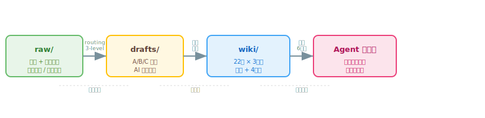

# Open Knowledge Studio

> 你的知识库就是你的模型——你每天都在训练它。

大模型人人拿到的都一样，但你每天读到的、踩过的、验证过的，只属于你。Open Knowledge Studio 是你的 AI 工作记忆层：保存一个决策、一个洞察、一个来源、一段对话，让它可搜索、和已有知识相连、被 AI Agent 从同样的上下文调用。日积月累，它长成一份别人复制不来的知识库。

你不需要一次性配置所有东西。先保存一条知识，再找到它，然后让 Agent 用它。一旦这个循环跑通，Studio 就变得容易理解了——它背后的[理念](philosophy.md)也就不言自明。

## 核心概念

| 概念 | 是什么 | 了解更多 |
|------|--------|----------|
| **理念** | 知识库即模型，你每天用反馈训练它，人人都是标注师 | [理念 →](philosophy.md) |
| **每日循环** | 收集 → 入料 → 分级 → 审查 → 沉淀 → 召回的训练闭环 | [每日循环 →](daily-loop.md) |
| **Memory** | 从原始材料蒸馏出的持久知识——一个 concept、strategy 或 anti-pattern | [Memories →](memories.md) |
| **Raw Material** | 蒸馏前的入料层——文章、论文、仓库笔记、对话 | [Raw Materials →](raw-materials.md) |
| **召回引擎** | 六因子评分找到最相关知识：token overlap + substring + topic trace + type boost + review penalty + memory curve | [召回引擎 →](recall-engine.md) |
| **Dreaming 循环** | 人工审查的知识演化：raw → AI 蒸馏 → drafts → 人工审查 → wiki | [Dreaming 循环 →](dreaming-cycle.md) |

## 核心管线

```
raw/（人类收集的原始材料）
  ↓ /ingest — 三级路由 → A/B/C 分级
drafts/（中间态草稿）
  ↓ /promote — 人工审查
wiki/（策展知识，带衰减）
  ↓ oks search / /query — 6 因子召回
注入 Agent 上下文
```

## 架构总览




## 独特之处

- **人人都是标注师** — 底座模型人人相同，但你的审查与取舍塑造出独一无二的知识库。这份独特性，就是你的护城河。
- **Knowledge as Code** — 所有知识以 Markdown + YAML frontmatter 存储，通过 Git 版本管理。
- **Git IS the migration** — 无数据库，schema 变更通过 `_meta/` 版本化。
- **Agent-direct** — OKS 只提供能力，不包装工具调用。Agent 是 AI 引擎，CLI 只做文件操作 + 召回评分。
- **人工审批门控** — 系统绝不在未经审查的情况下将 raw 内容提升到 wiki。
- **衰减是特性** — 知识随时间遗忘。常用的保持敏锐，被遗忘的淡入归档。
- **第一天少做** — 保存一条记忆，跑一次搜索，验证它工作。不要一次性配置所有东西。

## 准备开始？

```bash
pip install open-knowledge-studio
oks init my-knowledge-base
cd my-knowledge-base
oks status
oks search "your query"
```

- **[快速开始](start-here.md)** — 最短可用路径：保存一条 → 搜索到它 → 验证工作
- **[理念](philosophy.md)** — 为什么说知识库就是你在训练的模型
- **[每日循环](daily-loop.md)** — 把训练闭环变成每天都能跑的流程
- **[自动驾驶](autonomous.md)** — 人类判断随自动化程度如何分级（L0→L5）
- **[案例](cases.md)** — 托管你的简历 / GitHub / 科研，看循环怎么落地
- **[使用你的知识](memories.md)** — wiki 页面结构、类型和搜索
- **[Raw Materials](raw-materials.md)** — 原始材料、A/B/C 分级、蒸馏工作流

---


