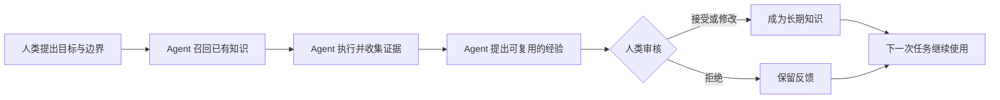

  
OPEN KNOWLEDGE STUDIO

  <h1>让 Agent 记住团队已经确认的判断</h1>
  
你给目标、材料和反馈，Agent 负责执行与整理。OKS 把来源、审核结果和可复用知识保存下来，让下一次任务接着做，而不是从头解释。

  

    <a class="btn btn-primary" href="{{ '/first-knowledge-loop.html' | relative_url }}">教 Agent 学会一件事</a>
    <a class="btn" href="{{ '/oh-my/' | relative_url }}">查看真实案例</a>
  

  

    <strong>有来源</strong>
    重要判断可以回到具体材料
  

  

    <strong>先审核</strong>
    Agent 只能提出 Candidate，不能自我批准
  

  

    <strong>可复用</strong>
    下一次任务直接召回已确认的经验
  

## Agent 会做事，但不会自然记住你的判断

一次任务里，你会纠正事实、说明边界、否决方案，也会告诉 Agent 什么结果才算完成。会话结束、上下文压缩或执行者切换后，这些判断很容易消失。下一次任务于是又从解释背景开始。

OKS 要解决的问题是：

> Agent 如何在人机协同中持续学习，并保持长任务执行的稳定？

这里的“学习”不是修改模型权重，而是让 Agent 使用一套由人类反馈持续校准、能够追溯来源的外部知识模型。

## 你负责判断，Agent 负责执行

  

    <h3>你给方向</h3>
    
说明要解决的问题、什么不能做、哪些证据可信，并决定一条经验是否值得长期保留。

  

  

    <h3>Agent 做工作</h3>
    
查找已有知识、处理材料、记录执行过程、暴露冲突，并把可能有用的经验整理成待审核提议。

  

  

    <h3>OKS 保持连续</h3>
    
保存来源、提议、审核结果和使用反馈，让后续 Agent 能沿用已经确认的判断。

  

## 一次学习如何发生

```mermaid
flowchart LR
    H1["人类提出目标与边界"] --> R["Agent 召回已有知识"]
    R --> A["Agent 执行并收集证据"]
    A --> C["Agent 提出可复用的经验"]
    C --> H2{"人类审核"}
    H2 -->|接受或修改| K["成为长期知识"]
    H2 -->|拒绝| F["保留反馈"]
    K --> N["下一次任务继续使用"]
    F --> N
```

Agent 可以提出知识，但不能批准自己的提议。被使用很多次也只能说明它常被需要，不能证明它一定正确。

## Mail 是协作侧车，不是第二个产品

跨 Session、Agent 或机器确实需要留下的交接、结果、阻塞、批注和知识引用，会进入 OKS Mail；Thread 只是这段事实的详情上下文。Mail 不复制 Wiki，不代表在线或执行完成，也不会在没有 Host Adapter 时唤醒 Agent。详见[产品边界与协作模型](concepts/product-boundary.html)和 [Mail 协议](reference/mail-protocol.html)。

## 使用时，你只需要做三件事

1. 告诉 Agent 你正在解决什么，以及哪些决定必须由你做。
2. 提供材料，或允许 Agent 在约定范围内收集证据。
3. 审核 Agent 提出的长期知识：接受、修改、拒绝，或者暂时不决定。

安装、收录、整理、保存和召回都由 Agent 调用 OKS 完成。你不需要记住命令，也不需要理解目录结构才能开始。

## 它不会替你做什么

- 来源被保存，不代表来源中的主张已经证实。
- Agent 写出的总结，不会自动变成长期知识。
- 证据不足时，系统应说明缺口，而不是补出一个确定答案。
- 发布、合并、删除和外部发送等高风险动作，仍需要人的明确授权。

从[第一次学习循环](first-knowledge-loop.html)开始，或直接阅读案例[托管你的学习](oh-my/study.html)。
