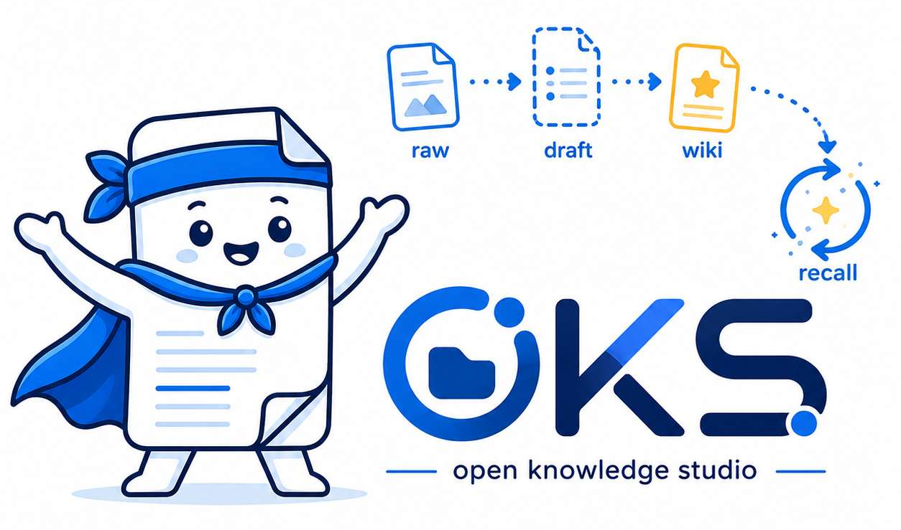

<div align="center">
  
</div>

# Open Knowledge Studio

> 让 Agent 把资料转化为可审核、可追溯、以后能重新召回利用的知识。

OKS 是一个 Agent-native、文件系统优先的知识工作台——**Agent 状态栏注入 + Recall 原语**。来源先成为 Raw 证据，Agent 再提出 Candidate；只有经过人的审核，内容才进入 Wiki，并在未来任务中被 Recall 注入上下文。

```text
你的资料 → Candidate → 人工审核 → Wiki → Recall 注入
```

## 选择下一步

| 你现在要做什么 | 从这里进入 |
|---|---|
| 第一次使用 | **[安装](installation.md)** — 用唯一推荐方式安装并初始化 |
| 已经安装 | **[第一个知识闭环](first-knowledge-loop.md)** — 用自己的真实资料跑通一次 |
| 不确定哪里出错 | **[确认 OKS 正在工作](verify.md)** — 按成功信号逐步检查 |

## OKS 负责什么

- **保留来源**：Raw 保存原始材料和可追溯证据。
- **提出知识**：Agent 根据证据生成 Candidate，并执行 A/B/C 分级。
- **保留人的判断**：Candidate 经过审核后才能成为 Wiki 知识。
- **在任务中找回来**：`oks recall` 同时检索 Raw episodic 与 Wiki knowledge，hook 自动注入会话。
- **把失败说清楚**：`partial`、`failed`、`skipped` 不会被包装成成功。

## 核心边界

- Core 不调用 AI API，只负责文件、协议、审核生命周期和 Recall 评分。
- 采集与提取由独立发布的 `oks-connector` 和 Agent 可用工具完成。
- `raw/executions/` 和 `raw/.logs/` 是溯源记录，不作为记忆参与 Recall。
- `[verified]` 只来自 trace 证据或 `human_reviewed_at`，不能由模型自行声明。

## 按需要深入

- **开始使用**：[安装](installation.md) · [快速入门](quick-start.md) · [第一个知识闭环](first-knowledge-loop.md) · [导入已有对话](import-conversations.md) · [确认在工作](verify.md) · [召回](recall.md) · [审核 Candidate](review-candidates.md)
- **使用 OKS**：[记忆](usage/memories.md) · [对话](usage/conversations.md) · [资料库](usage/library.md) · [上下文注入](usage/context-injection.md) · [你的档案](usage/profiles.md)
- **案例**：[可复制的真实场景](examples.md)
- **概念**：[哲学](concepts/philosophy.md) · [宪法](concepts/constitution.md) · [记忆模型](concepts/memory-model.md) · [文件系统范式](concepts/file-system-paradigm.md)
- **召回质量（v0.6.1）**：定名 **OKS Triple-Layer Recall**（Node-BM25 召回 + Soul Boost 注入 + Memory Curve 衰减）。50-case 语义改写消融实测：fts5 R@1=82.5% / R@3=92.5% / MRR=0.907（vs native 6+1 R@1=52.5%）。见 [召回评估](algorithms/recall-evaluation.md)。

- **算法**：[召回引擎](algorithms/recall-engine.md) · [衰减系统](algorithms/decay-system.md) · [召回评估](algorithms/recall-evaluation.md)
- **连接**：[备份与导出](connect/backup-export.md)
- **参考**：[CLI](reference/cli.md) · [ingest 流程](reference/ingest.md) · [故障排除](reference/troubleshooting.md) · [社区](reference/community.md)
