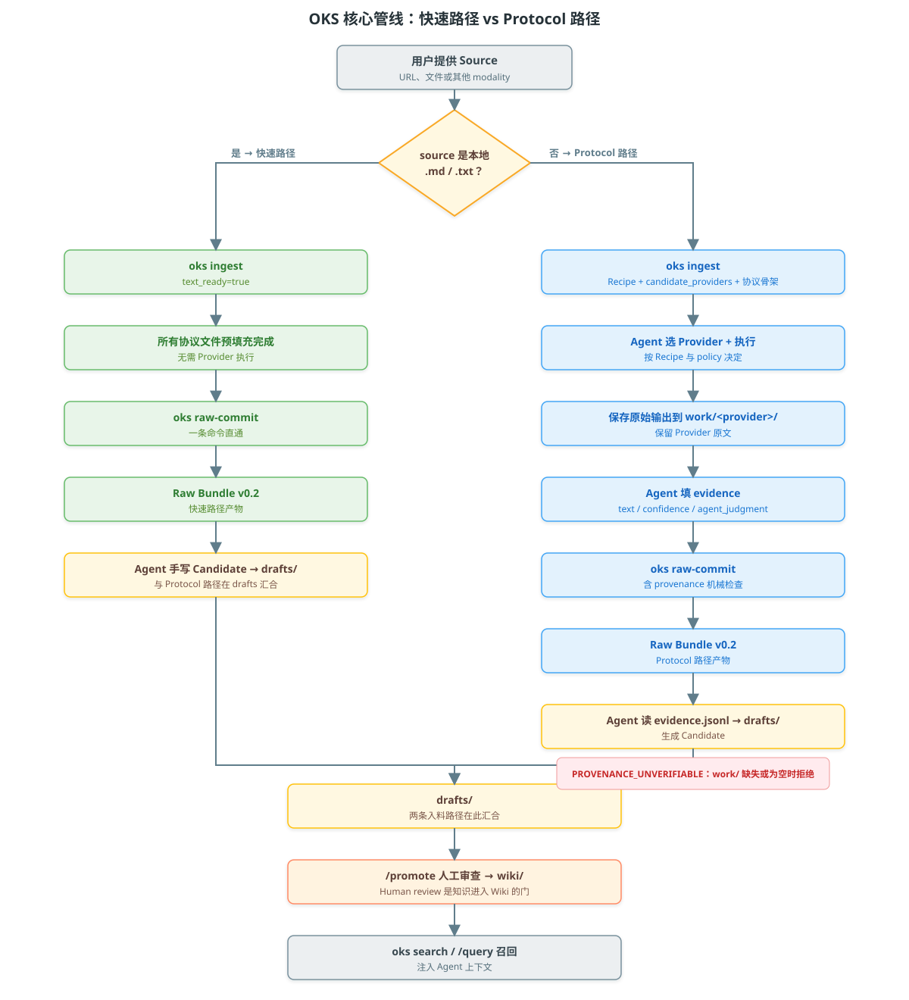

# Open Knowledge Studio

> 你的知识库就是你的模型——你每天都在训练它。

大模型人人拿到的都一样，但你每天读到的、踩过的、验证过的，只属于你。Open Knowledge Studio 是你的 AI 工作记忆层：保存一个决策、一个洞察、一个来源、一段对话，让它可搜索、和已有知识相连、被 AI Agent 从同样的上下文调用。日积月累，它长成一份别人复制不来的知识库。

你不需要一次性配置所有东西。先保存一条知识，再找到它，然后让 Agent 用它。一旦这个循环跑通，Studio 就变得容易理解了——它背后的[理念](philosophy.md)也就不言自明。

## 核心概念

| 概念 | 是什么 | 了解更多 |
|------|--------|----------|
| **理念** | 知识库即模型，你每天用反馈训练它，人人都是标注师 | [理念 →](philosophy.md) |
| **每日循环** | 收集 → 入料 → 分级 → 审查 → 沉淀 → 召回的训练闭环 | [每日循环 →](daily-loop.md) |
| **Memory** | 从原始材料蒸馏出的持久知识——一个 concept、strategy 或 anti-pattern | [Wiki →](wiki.md) |
| **Raw Material** | 蒸馏前的入料层——文章、论文、仓库笔记、对话 | [Raw 标准 →](raw-multimodal-standard.md) |
| **召回引擎** | 6+1 因子评分找到最相关知识：token overlap + substring + topic trace + type boost + 审查加分 + memory curve | [召回引擎 →](recall-engine.md) |
| **Dreaming 循环** | 人工审查的知识演化：raw → AI 蒸馏 → drafts → 人工审查 → wiki | [Dreaming 循环 →](dreaming-cycle.md) |

## 核心管线



本地 `.md` / `.txt` 走快速路径，其他 modality 走 Protocol 路径；两者最终都必须经过 `drafts/` 和人工审查，才能进入 `wiki/` 并参与召回。

> **详细操作手册**: [Agent-Native Ingest 操作手册](ingest/agent-native-ingest-walkthrough.md) — 从 URL 到 promote 的逐步指南，含常见错误和解决方法。
> **协议对象说明**: [协议对象关系](ingest/protocol-objects.md) — SourceEnvelope / EvidenceFragment / EvidenceManifest / RawBundle 的层级关系和字段含义。

## 当前架构与进度

v0.4.0-dev（最小可分发 Beta）已完成：

- **单 Wheel 包**: 仅 `knowledge_studio`，`oks_connector` 已移除
- **17 个 Provider** + 25 个能力动作
- **Raw Bundle v0.2** 严格验证管线（`oks raw-commit`，含 provenance 机械检查）
- **Agent 协议减负**: `ingest prepare` 预填充 evidence 槽位 + 返回 candidate_providers 短名单
- **6 能力族首屏**: 文本 / 网页 / PDF / 图片 / 音视频 / 平台 — 不暴露 Provider ID
- **技能单一事实源**（`skill_templates/`，构建时+运行时剥离）
- **248 个测试**（248 通过）

架构事实源和本轮工程记录见：

- **[核心架构](architecture/oks-core-architecture.md)** — v0.4.0 当前主事实源
- **[工程轮次 2-3](engineering-rounds-2-3.md)** — v0.3.0 合并后的架构加固与安全修复

多模态 Raw 协议的机器事实源位于本仓库 `schemas/`；Studio 只保留生命周期和调用入口。

## 架构总览

当前主架构图以核心知识闭环为准，并显式区分已验证、部分验证、尚未验证、人工门禁和外部能力来源：

[OKS Core Architecture](architecture/oks-core-architecture.md)

旧 SVG 主架构图已移除，避免把“设计存在”误读成“真实环境已全部验收通过”。

## 独特之处

- **人人都是标注师** — 底座模型人人相同，但你的审查与取舍塑造出独一无二的知识库。这份独特性，就是你的护城河。
- **Knowledge as Code** — 所有知识以 Markdown + YAML frontmatter 存储，通过 Git 版本管理。
- **Git IS the migration** — 无数据库，schema 变更通过 `_meta/` 版本化。
- **Agent-direct** — OKS 只提供能力，不包装工具调用。Agent 是 AI 引擎，CLI 只做文件操作 + 召回评分。
- **人工审批门控** — 系统绝不在未经审查的情况下将 raw 内容提升到 wiki。
- **衰减是特性** — 知识随时间遗忘。常用的保持敏锐，被遗忘的淡入归档。
- **第一天少做** — 保存一条记忆，跑一次搜索，验证它工作。不要一次性配置所有东西。

## 准备开始？

```bash
pipx install open-knowledge-studio && pipx ensurepath
oks init my-knowledge-base
cd my-knowledge-base
oks status
oks search "your query"
```

（pipx 本身：Ubuntu 用 `sudo apt install pipx`，macOS 用 `brew install pipx`，Windows 用 `py -m pip install --user pipx && py -m pipx ensurepath`。Ubuntu 24.04 / Homebrew Python 受 PEP 668 保护，直接 `pip install` 会报 externally-managed-environment；镜像滞后时加 `--pip-args="-i https://pypi.org/simple"`。）

- **[快速开始](start-here.md)** — 最短可用路径：保存一条 → 搜索到它 → 验证工作
- **[Agent-Native Ingest 操作手册](ingest/agent-native-ingest-walkthrough.md)** — URL/文件 → Provider → Evidence → Commit → Draft → Promote 完整实战
- **[协议对象关系](ingest/protocol-objects.md)** — SourceEnvelope / Fragment / Manifest / Bundle 的层级和字段
- **[理念](philosophy.md)** — 为什么说知识库就是你在训练的模型
- **[每日循环](daily-loop.md)** — 把训练闭环变成每天都能跑的流程
- **[自动驾驶](autonomous.md)** — 人类判断随自动化程度如何分级（L0→L5）
- **[案例](cases.md)** — 托管你的简历 / GitHub / 科研，看循环怎么落地
- **[使用你的知识](wiki.md)** — wiki 页面结构、类型和搜索
- **[Raw Materials](raw-multimodal-standard.md)** — 原始材料、证据和 Raw Bundle 边界

---


