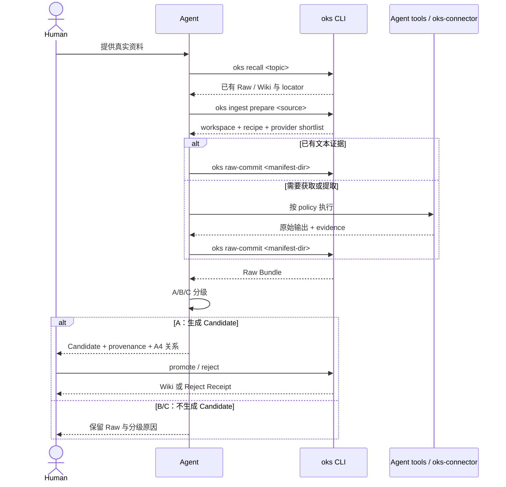

# Agent-Native Ingest 操作手册

从一条 URL 或本地文件出发，走完 Recall → Source → Evidence → Commit → Grade → Review 的
完整链路。本手册按你实际会遇到的顺序写，每个步骤标出常见错误和解决方法。

## Step 0：先 Recall，避免平行知识

收录前先查一次主题：

```bash
oks recall "<这份资料的主题>"
```

如果已有 Wiki 页面，在 Candidate 中记录 `relates_to` 和 `relationship`，关系只能是
`enriches`、`supersedes`、`confirms` 或 `challenges`。这不会跳过人工审核；它只是让
审核者看到新旧知识之间的关系。

## 两条路径

OKS 根据源类型自动选择路径：

| 源类型 | 路径 | 特点 |
|--------|------|------|
| 本地 `.md` / `.txt` | **快速路径** (`text_ready=true`) | 证据预填充，跳过 Provider 执行，直接 raw-commit |
| URL / PDF / 图片 / Office / 音视频 | **Protocol 路径** (`text_ready=false`) | 需要 Provider 执行，Agent 填协议文件后 raw-commit |

快速路径一步到位；Protocol 路径是本文重点。

## 完整流程（Protocol 路径）

### Step 1: `oks ingest prepare`

```bash
oks ingest prepare <source>
```

**输出**（JSON）：

```json
{
  "run_id": "run-abc123",
  "workspace": ".oks/runs/run-abc123/",
  "manifest_dir": ".oks/runs/run-abc123/manifest/",
  "modality": "web",
  "text_ready": false,
  "recipe": "# Recipe: Web\n\n...",
  "candidate_providers": [
    {"id": "firecrawl", "label": "Firecrawl", "status": "not_configured"},
    {"id": "trafilatura", "label": "Trafilatura", "status": "ready"}
  ],
  "next_step": "..."
}
```

**关键字段**：

- `recipe`：这个 modality 的完整 Recipe（required_capabilities、optional_capabilities、degradation chain、complete_when 条件）
- `candidate_providers`：覆盖 required capabilities 的 Provider 短名单。Agent 从这里选，不需要扫描全部注册项
- `text_ready`：`false` 表示走 Protocol 路径

**此时 workspace 里已经有**：

```
.oks/runs/<run_id>/manifest/
  source-envelope.json       ← 预填充（source_id, content_hash, modality 等）
  evidence-manifest.json     ← 骨架（evidence_records 有预填充槽位）
  fragments/frag-xxx.json    ← 骨架
  artifacts/                 ← 空（等 Provider 输出）
```

### Step 2: 读取 Recipe + 选 Provider

读 `recipe` 字段，理解需要哪些 evidence。

**不要**再单独跑 `oks capability status --json` 去扫描全部 Provider——`candidate_providers` 已经帮你过滤了。

从 `candidate_providers` 里选中一个 Provider。选择依据：

1. availability（ready > not_configured > unavailable）
2. 是否能满足 required capabilities
3. 是否需要远程上传（敏感内容优先本地 Provider）

需要 Provider 的详细执行说明时，才跑：

```bash
oks capability guide <provider>
```

### Step 3: 执行 Provider + 保存原始输出

调用 Provider 工具（MCP / API / CLI）。

**关键**：拿到 Provider 原始输出后，立即保存到 workspace：

```
.oks/runs/<run_id>/work/<provider>/output.<ext>
```

例如 Firecrawl：

```bash
# 保存原始 JSON 到 work 目录
mkdir -p .oks/runs/<run_id>/work/firecrawl/
# 将 Provider 返回的原始响应写入 output.json
```

**为什么必须做**：`raw-commit` 在 `status=complete` 时会**机械验证**这个文件存在且 >0 bytes。不存在 → `PROVENANCE_UNVERIFIABLE` 错误。

**常见错误**：
- 忘了建 `work/<provider>/` 目录
- 把 Agent 改写后的内容当"原始输出"保存——必须保存 Provider 的**原始响应**
- Agent 自己总结了一段文字然后标 `producer=firecrawl` → provenance 非法

### Step 4: 填写 evidence-manifest.json

打开 `manifest/evidence-manifest.json`。`evidence_records` 里已经有预填充的槽位：

```json
{
  "evidence_id": "ev-abc123",
  "artifact_id": "art-abc123",
  "kind": "text_content",
  "method": "html_extract",
  "locator": {"kind": "document"},
  "text": null,
  "confidence": null,
  "agent_judgment": "mechanical"
}
```

你只需要填三个字段：

| 字段 | 含义 | 示例值 |
|------|------|--------|
| `text` | 从 Provider 原始输出中提取的证据内容 | Firecrawl 返回的页面正文 Markdown |
| `confidence` | 你对这条证据质量的信心 | `0.9`（清晰提取）、`0.5`（部分截断） |
| `agent_judgment` | 内容是机械提取还是你加工过 | `mechanical`（原文）、`agent_observed`（你改写过） |

**`agent_judgment` 的严格规则**：

- **`mechanical`**：仅当 text 是 Provider 原始输出的确定性转换（截取字段、编码转换、newline 规范化）。**不含任何 Agent 改写、总结、重排、注释。**
- **`agent_observed`**：你做了任何语义操作——总结、翻译、加标题、合并段落。此时 `producer.provider` 必须改为 `"agent-runtime"`，不能继续标 `"firecrawl"`。

`steps[]` 也是预填充的，你填 `provider` 和 `status`：

```json
{
  "capability": "web.extract",
  "provider": "firecrawl",
  "status": "succeeded",
  "reason": null
}
```

### Step 5: `oks raw-commit`

```bash
oks raw-commit .oks/runs/<run_id>/manifest/
```

**常见错误**：

| 错误码 | 原因 | 解决方法 |
|--------|------|----------|
| `PROVENANCE_UNVERIFIABLE` | `status=complete` 但 `work/<provider>/output.*` 不存在或为空 | 检查是否真的保存了 Provider 原始输出 |
| `MISSING_ARTIFACT` | 证据引用了不存在的 artifact 文件 | 检查 `artifact_id` 是否对应 `artifacts/` 中的实际文件 |
| `ARTIFACT_HASH_MISMATCH` | 文件内容和声明的 sha256 不一致 | 重新计算 hash 或确认文件内容未被意外修改 |
| `EVIDENCE_COUNT_MISMATCH` | `modalities` 里的 evidence_count 加起来 ≠ 实际 evidence 条数 | 更新 `modalities` 中的计数 |

**PROVENANCE_UNVERIFIABLE 排障细节**：

- 这个检查只适用于 `steps[]` 中 `provider` 为注册 Provider（firecrawl/pdf-lite/rapidocr 等）且 `status` 为 `succeeded`/`degraded` 的步骤
- `runtime-tool`、`agent-runtime`、`text-read`、`human` 豁免此检查
- 同一个 Provider 的多个步骤只检查一次
- 文件必须有内容——空文件不通过

成功输出：

```json
{
  "status": "committed",
  "bundle_id": "bundle:2789f4ff",
  "bundle_path": "raw/2026/08/07/agent-capture/bundle-2789f4ff",
  "evidence_count": 2
}
```

### Step 6: A/B/C 分级

Agent 在 Raw Bundle 提交后分级：

| 等级 | 处理 |
|---|---|
| A | 证据支持可复用判断，生成 Candidate |
| B | 有价值但证据薄弱或过于情境化；保留 Raw 和原因，不生成 Candidate |
| C | 噪声、重复或只有事实列表；保留 Raw 和原因，不生成 Candidate |

只有 A 级继续下面的 Candidate 步骤。分级不是晋升，任何 Candidate 仍须人工审核。

### Step 7: 生成 Candidate

读 Raw Bundle 的 `evidence.jsonl`，基于证据写一个 Markdown 草稿到 `drafts/<slug>.md`：

```yaml
---
title: "页面标题"
draft_type: concept            # concept | strategy | anti-pattern
draft_area: computing          # 目标知识域
importance: 0.7
confidence: 0.5
created: "2026-08-07"
tags: "web, example"
status: pending
source_type: agent-ingest
relates_to: ""                 # 可选：已有 Wiki slug
relationship: ""              # enriches | supersedes | confirms | challenges
---
```

**字段名必须是 `draft_type` / `draft_area`**，不是 `type` / `area`。`oks drafts promote`
只读前者；写成 `type: strategy, area: science` 会**静默**落到
`wiki/computing/concepts/`（回退默认值），没有任何报错。

**重要**：Candidate 是一个 Markdown 文件，不是 OKS 协议对象。不要跑 `oks schema show candidate`。

### Step 8: Human Review

```bash
oks drafts list              # 查看所有草稿
oks drafts promote <slug>    # 提升到 wiki/
oks drafts reject <slug>     # 拒绝并保留 review receipt
```

或用 `/promote` 技能交互式审查。

### Step 9: 验证召回

```bash
oks recall "关键词"
```

确认新知识能被召回。

---

## 快速路径（text_ready=true）

本地 Markdown / 纯文本会跳过 Provider 执行，但不会跳过分级和人工审核：

```bash
oks ingest prepare my-note.md
# text_ready: true → 所有协议文件已预填充完成

oks raw-commit .oks/runs/<run_id>/manifest/
# → 直接产出 Raw Bundle

# 然后执行 A/B/C 分级；仅 A 级生成 Candidate 并进入人工审核
```

## 泳道图



图中分支对应两条提取路径；两条路径都会汇合到 Raw，再由 A/B/C 决定是否生成
Candidate。只有人工批准的 Candidate 才进入 Wiki。

---


