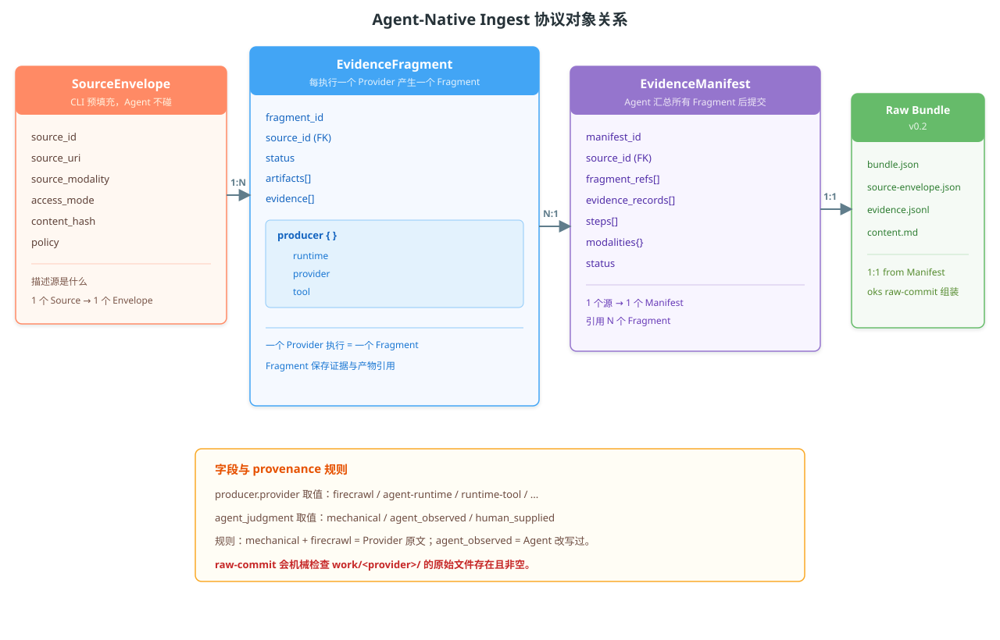

# 协议对象关系

Agent-Native Ingest 路径涉及四个协议对象和一个产物。本文说明它们的层级关系、
各自包含什么字段、谁负责填什么，以及它们如何被 `oks raw-commit` 验证和组装。

## 对象层级



关系方向是：一个 `SourceEnvelope` 产生 N 个 `EvidenceFragment`，Agent 再把这些 Fragment 汇总进一个 `EvidenceManifest`，最后由 `oks raw-commit` 组装成一个 Raw Bundle v0.2。

### 一张表说清楚

| 对象 | 谁创建 | 谁填充 | 关系 |
|------|--------|--------|------|
| **SourceEnvelope** | `oks ingest prepare` | CLI 预填充所有确定性字段 | 1 个源 → 1 个 Envelope |
| **EvidenceFragment** | `oks ingest prepare`（骨架） | Agent 填 evidence 内容 | 1 个 Provider → 1 个 Fragment |
| **EvidenceManifest** | `oks ingest prepare`（骨架） | Agent 汇总所有 Fragment | 1 个源 → 1 个 Manifest，引用 N 个 Fragment |
| **Raw Bundle v0.2** | `oks raw-commit` | CLI 组装 | 1 个 Manifest → 1 个 Bundle |

## SourceEnvelope

**文件**: `manifest/source-envelope.json`

描述**源是什么**。全部由 CLI 预填充，Agent 不碰。

```json
{
  "schema_version": "oks-source-envelope/v0.1",
  "source_id": "src-abc123",
  "source_uri": "https://example.com/page",
  "source_modality": "web",
  "access_mode": "public_url",
  "captured_at": "2026-08-07T12:00:00Z",
  "captured_by": {"runtime": "claude-code", "model": null, "skill": "ingest"},
  "content_hash": "sha256...",
  "evidence_manifest_ref": "manifest-abc123",
  "title": "Example Page",
  "policy": {"remote_processing": "allow", "sensitivity": "internal"}
}
```

| 字段 | 含义 | 谁填 |
|------|------|------|
| `source_id` | 源的唯一 ID，跨 Manifest 引用 | CLI |
| `source_modality` | 文件类型推断的 modality（text/pdf/web/image/video/audio/office） | CLI |
| `access_mode` | 访问方式（local_file / public_url / manual） | CLI |
| `content_hash` | 原始源内容的 SHA-256（用于去重） | CLI |
| `policy.remote_processing` | 是否允许上传到远程服务（deny 时 Agent 只能用本地 Provider） | CLI |

## EvidenceFragment

**文件**: `manifest/fragments/<fragment_id>.json`

描述**一个 Provider 执行产生了什么证据**。骨架由 CLI 预填充，evidence 内容由 Agent 填。

```json
{
  "schema_version": "oks-evidence-fragment/v0.1",
  "fragment_id": "frag-abc123",
  "source_id": "src-abc123",
  "producer": {
    "runtime": "oks",
    "provider": "firecrawl",
    "tool": "firecrawl"
  },
  "status": "succeeded",
  "artifacts": [
    {
      "artifact_id": "art-abc123",
      "kind": "primary_text",
      "path": "content.md",
      "sha256": "sha256..."
    }
  ],
  "evidence": [
    {
      "evidence_id": "ev-abc123",
      "artifact_id": "art-abc123",
      "kind": "text_content",
      "method": "html_extract",
      "locator": {"kind": "document"},
      "text": "<实际证据内容>",
      "confidence": 0.9,
      "agent_judgment": "mechanical"
    }
  ],
  "modalities": {
    "text": {"modality": "text", "status": "succeeded", "evidence_count": 1}
  }
}
```

### `producer` 字段 —— 你最容易踩的坑

`producer` 是一个**对象**，有三个字段：

| 字段 | 含义 | 示例 |
|------|------|------|
| `runtime` | 谁编排了这次执行 | `"oks"` |
| `provider` | 能力来源的分类 | `"firecrawl"`（注册 Provider）、`"agent-runtime"`（Agent 自身）、`"runtime-tool"`（临时工具如 curl） |
| `tool` | 具体工具名 | `"firecrawl"`（同注册 Provider ID）、`"curl"`（临时工具的实际名称） |

**关键规则**：

- 注册 Provider 的输出 → `provider: "firecrawl"`, `tool: "firecrawl"`
- Agent 自己改写的内容 → `provider: "agent-runtime"`, `tool: "agent-runtime"`
- curl / playwright 等临时工具 → `provider: "runtime-tool"`, `tool: "curl"`

**绝不允许**：用了 curl 抓网页但标 `provider: "firecrawl"`。这是 provenance 造假。

### `agent_judgment` 字段

在每条 evidence record 上：

| 值 | 含义 | 何时用 |
|----|------|--------|
| `mechanical` | 文本是 Provider 原始输出的确定性转换 | 仅限：字段提取、编码转换、newline 规范化、安全脱敏 |
| `agent_observed` | 文本经过了 Agent 的语义处理 | 总结、翻译、重排、加标题、注释、合并段落 |
| `human_supplied` | 人工提供的内容 | 用户手动粘贴或上传 |

**核心规则**：`agent_judgment: "mechanical"` + `producer.provider: "firecrawl"` 意味着文本**是** Firecrawl 的原始输出，Agent 没动过。如果你改写过了，两个都得改。

## EvidenceManifest

**文件**: `manifest/evidence-manifest.json`

Agent 汇总所有 Fragment 后提交的**最终证据声明**。

```json
{
  "schema_version": "oks-evidence-manifest/v0.1",
  "manifest_id": "manifest-abc123",
  "source_id": "src-abc123",
  "status": "complete",
  "fragment_refs": ["frag-abc123"],
  "primary_artifact": {
    "artifact_id": "art-abc123",
    "kind": "primary_text",
    "path": "content.md",
    "sha256": "sha256..."
  },
  "evidence_records": [
    {
      "evidence_id": "ev-abc123",
      "artifact_id": "art-abc123",
      "kind": "text_content",
      "method": "html_extract",
      "locator": {"kind": "document"},
      "text": "<证据内容>",
      "confidence": 0.9,
      "agent_judgment": "mechanical"
    }
  ],
  "modalities": {
    "text": {"modality": "text", "status": "succeeded", "evidence_count": 1}
  },
  "steps": [
    {
      "capability": "web.extract",
      "provider": "firecrawl",
      "status": "succeeded",
      "reason": null
    }
  ],
  "provenance": {
    "agent": {"runtime": "claude-code", "model": "claude-opus-5", "skill": "ingest"}
  }
}
```

### `status` 字段

| 值 | 含义 | 前提条件 |
|----|------|----------|
| `complete` | 证据充分，可以继续生成 Candidate | 所有 `complete_when` 条件满足 + work/ 文件存在 + 溯源合法 |
| `partial` | 证据不完整，但仍可尝试生成 Candidate | 部分 required capabilities 无法满足 |

没有 `failed` 状态——如果所有 Fragment 都失败，Agent 不应该提交 Manifest。

### `steps[]` 字段

记录每个 Provider 的尝试和结果：

```json
{
  "capability": "web.extract",
  "provider": "firecrawl",
  "status": "succeeded",
  "reason": null
}
```

`status` 取值：`succeeded`、`partial`、`degraded`、`failed`、`skipped`。

`raw-commit` 用 `steps[]` 来判断哪些 Provider 需要 work/ 输出文件。

### `complete_when` 条件

来自 Recipe。最终完整性由这些条件决定，**不**由"required capabilities 成功了多少个"决定。

例子：视频 Recipe 的 `complete_when: subtitles_or_transcript_available`。如果字幕提取失败但 ASR 转写成功，这个条件仍然满足——ingest 是 `complete`，不是 `partial`。

### 预填充与 Agent 填充分工

| 字段 | 谁填 | 说明 |
|------|------|------|
| `evidence_id` | CLI 预填充 | UUID |
| `artifact_id` | CLI 预填充 | UUID，Agent 可以修改 |
| `kind` | CLI 预填充 | 从 Recipe 的 capability 映射（如 `web.extract` → `text_content`） |
| `method` | CLI 预填充 | 从 capability 映射（如 `web.extract` → `html_extract`） |
| `locator` | CLI 预填充 | 默认 `{"kind": "document"}` |
| `text` | **Agent 填** | 从 Provider 原始输出提取的实际证据内容 |
| `confidence` | **Agent 填** | 0.0-1.0 |
| `agent_judgment` | CLI 预填充默认值，**Agent 可以覆盖** | `mechanical` 是默认；Agent 改写过就改成 `agent_observed` |

## Raw Bundle v0.2

**产物**，由 `oks raw-commit` 生成。包含：

```
raw/YYYY/MM/DD/agent-capture/bundle-<hash>/
  bundle.json           ← 组装后的 Bundle 元信息
  source-envelope.json  ← 快照
  evidence.jsonl        ← 所有 evidence records
  content.md            ← 主 artifact
```

## `raw-commit` 验证流程

```
source-envelope.json  ──→ Schema 验证
evidence-manifest.json ──→ Schema 验证
                            ↓
                        交叉引用检查（source_id 一致）
                            ↓
                        Artifact 检查（文件存在 + sha256 匹配）
                            ↓
                        Evidence 交叉引用（artifact_id 一致性）
                            ↓
                        Provenance 检查（work/<provider>/ 存在且 >0 bytes）
                            ↓
                        Locator 合法性检查
                            ↓
                        Raw Bundle 组装
```

**Provenance 检查的豁免规则**：

| Provider | 需要 work/ 文件？ | 原因 |
|----------|-------------------|------|
| firecrawl | 是 | 注册 Provider |
| pdf-lite | 是 | 注册 Provider |
| rapidocr | 是 | 注册 Provider |
| text-read | 否 | CLI 预填充的证据 |
| agent-runtime | 否 | Agent 自身能力 |
| runtime-tool | 否 | 临时工具，没有注册 |
| human | 否 | 人工提供 |

---


