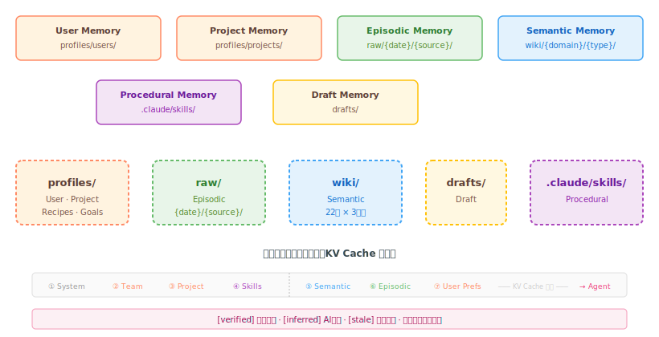

# Six-Type Memory Model（六型记忆模型）

*六型记忆、注入顺序（稳定层在前）、来源标签与冲突优先级。*

## 记忆类型



| 类型 | 存储 | 召回 | 衰减 | Scope |
|------|------|------|------|-------|
| User Memory | `profiles/users/{id}.md` | 直接读取 | 无 | `user_id` |
| Project Memory | `profiles/projects/{slug}.md` | 直接读取 | 无 | `project_slug` |
| Episodic Memory | `raw/{YYYY}/{MM}/{DD}/{source}/` | 关键词 + 新鲜度 | 无 | `topic_id` |
| Semantic Memory | `wiki/{domain}/{type}/` | 6 因子 + 曲线 | 类型 λ | `domain` |
| Procedural Memory | `.claude/skills/` | 关键词触发 | 无 | — |
| Draft Memory | `drafts/{slug}.md` | N/A | 无 | N/A |

## 桶映射

- User/Project → `profiles/`
- Episodic → `raw/`
- Semantic → `wiki/`
- Draft → `drafts/`
- Procedural → `.claude/skills/`（由 Agent 管理）

## 注入顺序（稳定层在前，KV Cache 友好）

1. System Prompt（稳定）
2. Team Profile + North Star（稳定，profiles/）
3. Project Memory（稳定，profiles/）
4. Tool Schema + Skills（半稳定，.claude/skills/）
   ─── KV Cache 断点 ───
5. Recalled Semantic Memory（每查询，wiki/）
6. Recalled Episodic Memory（每查询，raw/）
7. User Preferences（可变，profiles/）

## 来源标签

来源标签在注入时**动态生成**，不存储在 frontmatter 中：

- `[verified]` — `has_traces=true` 或 `status=active`
- `[inferred]` — `confidence < 0.5` 或 `status=provisional`
- `[stale]` — `status=stale`（被 challenges 关系标记）

## 冲突优先级

```
当前用户指令 > 工具验证事实 > 近期用户偏好 > 旧记忆 > 模型推理
```

{: .note }
当记忆与记忆之间产生矛盾时，按此优先级决定信任谁。当前用户的直接指令始终最高，模型自己的推理最低 — 因为我们信任人类判断和工具确认的事实胜过 AI 的推断。

## 下一步

* **[召回引擎](recall-engine.md)**：六型记忆如何被评分召回
* **[架构设计](architecture.md)**：五桶结构
* **[衰减系统](decay-system.md)**：记忆如何随时间变化

---


