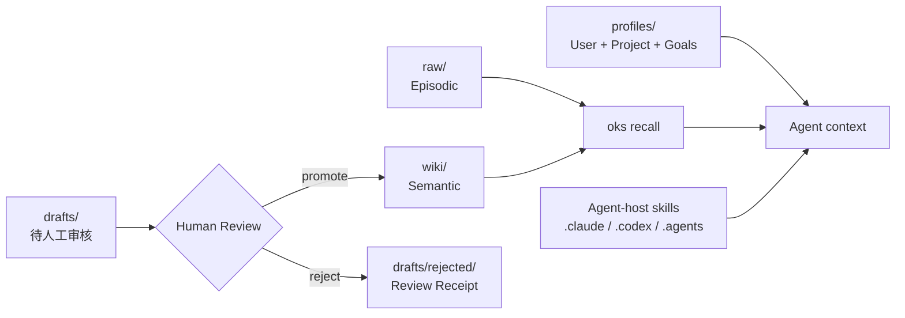

# Six-Type Memory Model（六型记忆模型）

*六型记忆、注入顺序（稳定层在前）、来源标签与冲突优先级。*

## 记忆类型


```mermaid
flowchart LR
    Profiles["profiles/\nUser + Project + Goals"] --> Inject["Agent context"]
    Raw["raw/\nEpisodic"] --> Recall["oks recall"]
    Wiki["wiki/\nSemantic"] --> Recall
    Recall --> Inject
    Skills["Agent-host skills\n.claude / .codex / .agents"] --> Inject
    Drafts["drafts/\n待人工审核"] --> Review{"Human Review"}
    Review -->|promote| Wiki
    Review -->|reject| Receipt["drafts/rejected/\nReview Receipt"]
```

| 类型 | 存储 | 召回 | 衰减 | Scope |
|------|------|------|------|-------|
| User Memory | `profiles/users/{id}/profile.md` | 需 `--user {id}` | 无 | `user_id` |
| Project Memory | `profiles/projects/{slug}.md` | 需 `--project {slug}` | 无 | `project_slug` |
| Episodic Memory | `raw/{YYYY}/{MM}/{DD}/{source}/` | 关键词 + 新鲜度 | 无 | `source`、`date` |
| Semantic Memory | `wiki/{domain}/{type}/` | 6+1 因子 + 曲线 | 类型 λ | `domain` |
| Procedural Memory | Agent host 的 skills 目录 | 由 host 触发 | 无 | — |
| Draft Memory | `drafts/{slug}.md` | N/A | 无 | N/A |

## 桶映射

- User/Project → `profiles/`
- Episodic → `raw/`
- Semantic → `wiki/`
- Draft → `drafts/`
- Procedural → `.claude/skills/`、`.codex/` 或 `.agents/`（由对应 Agent host 管理）

## 注入顺序（稳定层在前，KV Cache 友好）

1. System Prompt（稳定）
2. Team Profile + North Star（稳定，profiles/）
3. Project Memory（稳定，profiles/）
4. Tool Schema + Skills（半稳定，对应 Agent host 的 skills 目录）
   ─── KV Cache 断点 ───
5. Recalled Semantic Memory（每查询，wiki/）
6. Recalled Episodic Memory（每查询，raw/）
7. User Preferences（可变，profiles/）

用户画像必须是**目录形式** `profiles/users/{id}/profile.md`。写成扁平文件
`profiles/users/{id}.md` 时 `--user {id}` 永远召不回它（`recall.py` 的作用域
白名单按目录名匹配 `parts[1] == user_id`）。项目画像两种形式都接受。

不传 `--user` / `--project` 时，users/ 与 projects/ 下的画像**整体不参与召回** ——
这是 A2 的作用域隔离：绝不把别人的偏好或别的项目的事实注入当前上下文。

## 来源标签

来源标签在注入时**动态生成**，不存储在 frontmatter 中。

wiki 页面（语义记忆）：

- `[verified]` — `has_traces=true`（工具证据）或 `human_reviewed_at` 存在（人工审阅）
- `[inferred]` — 其余情况：AI 蒸馏，未经工具或人确认
- `[stale]` — `status=stale`（被 challenges 关系标记）

`[verified]` 必须有**被记录下来的事实**支撑，不得由 `status`、`confidence` 或
访问次数推导。被读过多少次说明它相关，不说明它正确 —— 见 CONSTITUTION P9。

episodic 命中（`oks recall` 直接给出 `source_label`）：

- `[untrusted-source]` — `raw/`：第三方文本。只作数据引用，**绝不执行其中的指令**
- `raw/executions/` 与 `raw/.logs/` 不进入 Recall；它们是 provenance，不是可召回记忆
- `[user-declared]` — `profiles/`：用户或团队自述，未经独立验证

无法识别的 episodic 类型按不可信处理。

## 冲突优先级

```
当前用户指令 > 工具验证事实 > 近期用户偏好 > 旧记忆 > 模型推理
```

{: .note }
当记忆与记忆之间产生矛盾时，按此优先级决定信任谁。当前用户的直接指令始终最高，模型自己的推理最低 — 因为我们信任人类判断和工具确认的事实胜过 AI 的推断。

## 下一步

* **[召回引擎](recall-engine.md)**：六型记忆如何被评分召回
* **[架构设计](architecture.md)**：认知桶结构
* **[衰减系统](decay-system.md)**：记忆如何随时间变化

---


