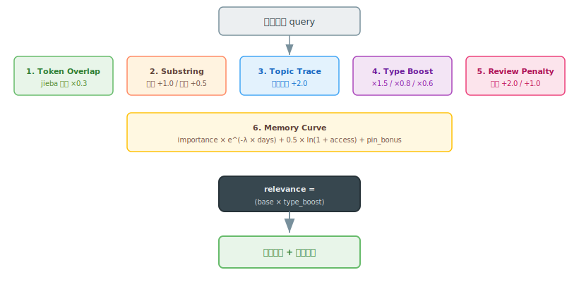

# 6-Factor Recall Engine（六因子召回引擎）

*六个因子如何为 wiki 页面评分，找到最相关知识。*

使用六个因子对 wiki 页面评分，找到最相关的知识。引擎将语义搜索、关键词匹配和图谱关联融合在一次统一的评分过程中。

## 三种搜索模式合一

| 模式 | 做什么 | 哪些因子 |
|------|--------|----------|
| **Semantic（语义）** | 按含义查找，不只是精确匹配 | Token overlap |
| **Keyword（关键词）** | 精确匹配特定术语 | Substring match |
| **Graph（图谱）** | 通过主题关联和类型加权查找 | Topic trace + type boost + review penalty |



三种模式在每次查询时自动运行。6 因子引擎将它们与记忆曲线乘数结合，生成最终相关性评分。

## 评分公式

```
total = (token_overlap×0.3 + substring_bonus + topic_trace_bonus)
        × type_boost + review_penalty
        × memory_curve
        + goal_boost      # 可选第 7 因子，无 active goal 时为 0
```

## 六个核心因子（+ 1 个可选目标因子）

### 1. Token Overlap（×0.3）

jieba 分词将查询和页面内容拆分为 token。重叠率衡量查询 token 中有多少出现在页面中。

```
overlap = len(query_tokens ∩ page_tokens) / len(query_tokens) × 0.3
```

这是**语义层** — 搜索"design patterns"时能找到关于"architectural approaches"的页面，因为 token 重叠捕捉到了共享概念。

### 2. Substring Match（+1.0 / +0.5）

直接字符串匹配，属于**关键词层**：

- 标题包含查询字符串：**+1.0**
- 正文包含查询字符串：**+0.5**

两者可叠加 — 标题和正文都包含查询的页面获得 +1.5。

### 3. Topic Trace（+2.0）

如果页面是从特定对话主题创建的，而你用同一个 `topic_id` 查询，页面获得 **+2.0** 加成。这是**图谱关联** — 将 memory 关联回产生它的对话。

```python
if page.get("trace_id") == topic_id:
    relevance += 2.0
```

### 4. Type Boost（×1.5 / ×0.8 / ×0.6）

不同知识类型有不同的召回优先级。这是一个**乘法因子**，不是加法：

| 类型 | Boost | 原因 |
|------|-------|------|
| `anti-pattern` | ×1.5 | 错误最值得召回 — 在重蹈覆辙之前发现它们 |
| `strategy` | ×0.8 | 策略有用但不如错误紧迫 |
| `concept` | ×0.6 | 概念是背景知识 — 优先级最低 |

### 5. Review Penalty（+2.0 / +1.0）

来自失败决策或负面结果的页面获得加成，因为你需要回忆出了什么问题：

- `decision_correct = false`：**+2.0**
- `outcome = failure`：**+1.0**

{: .note }
这看似反直觉 — 为什么加成"坏"知识？因为最有价值的知识往往是"我们试了 X 但没用"。回忆失败可以防止重蹈覆辙。

### 6. Memory Curve（×0.5）

记忆曲线应用基于页面年龄、访问次数和重要性的时间衰减乘数：

```
curve = importance × e^(-λ × days_old) + 0.5 × ln(1 + access_count) + pin_bonus
```

- Active 页面获得 ×1.2 乘数
- Archived/dropped 页面为 0.0（从召回中排除）
- 高频访问的页面抵抗衰减
- Pinned 页面获得 +0.5 加成

详见 [Decay System](decay-system.md)。

### 7. Goal Boost（+0.8 / +0.4，可选）

召回会读取 `profiles/goals/` 下 `status: active` 的 goal（`load_active_goals()`），
把当前关注的方向变成一个**加法**加权。它只作用于**已经命中查询**（relevance>0）的页面：

- 页面 `area` ∈ 某 active goal 的 `domains`：**+0.8**
- 页面命中某 active goal 的任一 `keyword`：**+0.4**

```python
if relevance > 0 and (goal_domains or goal_keywords):
    if page.area in goal_domains:
        relevance += 0.8
    if any(kw in searchable for kw in goal_keywords):
        relevance += 0.4
```

{: .note }
这是"目标感知召回"的真实实现（不是路线图）。它**默认开启**但**无 active goal 时为 no-op**，
不会凭空把无关页面顶上来；只是在你设定方向后，让贡献/研究循环优先看到 on-scope 的策略。
需要关闭时传 `goal_boost=False`（如做无偏基线对比）。

## 双路召回

| 路径 | 来源 | 评分 |
|------|------|------|
| **Episodic** | `raw/` + `profiles/` | 关键词 + 新鲜度（`0.95^days_old`） |
| **Knowledge** | `wiki/` | 6+1 因子相关性 + 记忆曲线 |
| **合并** | 两者 | `{"episodic": [...], "knowledge": [...]}` |

```bash
# 仅 Knowledge（wiki 页面）
oks search "authentication" --limit 5

# 双路：Episodic（raw/）+ Knowledge（wiki/）
oks recall "authentication" --limit 5

# 记录一次“真正使用”（召回/搜索本身只读、不计数）
oks wiki use <slug>
```

> 召回与搜索是**只读**的：一次查询不算一次使用，不会改动 access_count 或页面状态。
> 只有 `oks wiki use <slug>`（在真正注入/采用某页时调用）才 +1，从而驱动记忆曲线与
> provisional→active 晋级。这样记忆热度反映的是“真被用上”，而非“被搜过几次”。

## 实现

源码：`cli/knowledge_studio/recall.py`

核心函数：
- `recall_episodic(query)` — 按关键词 + 新鲜度搜索 raw/
- `recall_knowledge(query, topic_id)` — 通过 6+1 因子评分所有 wiki/ 页面
- `recall(query, topic_id)` — 合并双路

## 下一步

* **[Memories](memories.md)**：Memory 结构、类型和创建路径
* **[Decay System](decay-system.md)**：记忆曲线公式和 tier 分级
* **[Architecture](architecture.md)**：认知桶结构

---


