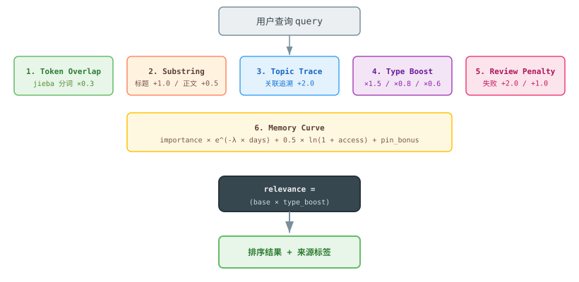

# 6+1 Factor Recall Engine（六加一因子召回引擎）

*六个核心因子 + 一个可选目标因子，为 wiki 页面评分，找到最相关知识。*

使用六个核心因子（外加可选的 goal boost）对 wiki 页面评分，找到最相关的知识。引擎将语义搜索、关键词匹配和图谱关联融合在一次统一的评分过程中。

## 三种搜索模式合一

| 模式 | 做什么 | 哪些因子 |
|------|--------|----------|
| **Semantic（语义）** | 按含义查找，不只是精确匹配 | Token overlap |
| **Keyword（关键词）** | 精确匹配特定术语 | Substring match |
| **Graph（图谱）** | 通过主题关联和类型加权查找 | Topic trace + type boost + review bonus |



三种模式在每次查询时自动运行。引擎把它们与记忆分数、review 加成结合，生成最终相关性评分。

## 评分公式

```
base  = token_overlap_count × 0.3 + substring_bonus + topic_trace_bonus
total = base × type_boost
        + review_bonus
        + memory_score × 0.5
        + goal_boost      # 可选第 7 因子，无 active goal 时为 0
```

注意：`base == 0` 时页面直接出局；review 与记忆分数是**加法**项，不是乘数。

## 六个核心因子（+ 1 个可选目标因子）

### 1. Token Overlap（×0.3）

jieba 分词将查询拆分为 token，统计出现在页面（标题+正文+标签）中的个数。

```
overlap = count(query_tokens 出现在 title+body+tags 中) × 0.3
```

这是**语义层** — 搜索"design patterns"时能找到关于"architectural approaches"的页面，因为 token 重叠捕捉到了共享概念。

### 2. Substring Match（+1.0 / +0.5）

直接字符串匹配，属于**关键词层**：

- 标题包含查询字符串：**+1.0**
- 正文包含查询字符串：**+0.5**

两者可叠加 — 标题和正文都包含查询的页面获得 +1.5。

### 3. Topic Trace（+2.0）

如果页面是从特定对话主题创建的，而你用同一个 `topic_id` 查询，页面获得 **+2.0** 加成。这是**图谱关联** — 将 memory 关联回产生它的对话。

```python
for trace in page.get("traces", []):
    if trace["kind"] == "discuss" and str(trace["id"]) == str(topic_id):
        base += 2.0
```

### 4. Type Boost（×1.5 / ×0.8 / ×0.6）

不同知识类型有不同的召回优先级。这是一个**乘法因子**，不是加法：

| 类型 | Boost | 原因 |
|------|-------|------|
| `anti-pattern` | ×1.5 | 错误最值得召回 — 在重蹈覆辙之前发现它们 |
| `strategy` | ×0.8 | 策略有用但不如错误紧迫 |
| `concept` | ×0.6 | 概念是背景知识 — 优先级最低 |

### 5. Review Bonus（+2.0 / +1.0）

来自失败决策或负面结果的页面获得加成，因为你需要回忆出了什么问题：

- `decision_correct = false`：**+2.0**
- `outcome = failure`：**+1.0**

{: .note }
这看似反直觉 — 为什么加成"坏"知识？因为最有价值的知识往往是"我们试了 X 但没用"。回忆失败可以防止重蹈覆辙。

### 6. Memory Score（+score×0.5）

页面的记忆分数（由记忆曲线计算：年龄衰减、访问次数、重要性、pin）以 **加法**方式进入相关性：`relevance += score × 0.5`。

```
score = importance × e^(-λ × days_old) + 0.5 × ln(1 + access_count) + pin_bonus
```

- Active 页面获得 ×1.2 乘数
- Archived/dropped 页面为 0.0（从召回中排除）
- 高频访问的页面抵抗衰减
- Pinned 页面获得 +0.5 加成

详见 [Decay System](decay-system.md)。

### 7. Goal Boost（+0.8 / +0.4，可选）

召回默认读取 `profiles/goals/` 下所有 `status: active` 的 goal，
也可以显式指定一个 goal 或关闭 goal。Goal 是一个**加法**加权，
只作用于**已经命中查询**（relevance>0）的页面：

- 页面 `area` ∈ 某 active goal 的 `domains`：**+0.8**
- 页面命中某 active goal 的任一 `keyword`：**+0.4**

```python
if relevance > 0 and (goal_domains or goal_keywords):
    if page.area in goal_domains:
        relevance += 0.8
    if any(kw in searchable for kw in goal_keywords):
        relevance += 0.4
```

{: .note }
这是"目标感知召回"的真实实现（不是路线图）。它不会凭空把无关页面顶上来；
只是在页面已经匹配查询后，让 on-scope 的策略优先出现。

- `--goal active`：默认行为，合并全部 active goal，适合交互使用；
- `--goal <slug>`：只使用一个 goal，适合可复现实验；
- `--goal none`：关闭 goal，作为无偏基线；
- Python API 的 `goal_boost=False` 继续保留，等价于关闭 goal。

## 双路召回

| 路径 | 来源 | 评分 |
|------|------|------|
| **Episodic** | `raw/` + `profiles/` | 关键词 + 新鲜度（`0.95^days_old`） |
| **Knowledge** | `wiki/` | 6+1 因子相关性 + 记忆曲线 |
| **合并** | 两者 | `{"episodic": [...], "knowledge": [...]}` |

```bash
# 仅 Knowledge（wiki 页面）
oks search "authentication" --limit 5

# 双路：Episodic（raw/）+ Knowledge（wiki/）
oks recall "authentication" --limit 5

# 固定单一 Goal，并查看每个评分因子
oks recall "authentication" --goal team --explain

# 输出机器可读 JSON，供离线评测使用
oks recall "authentication" --goal none --format json --explain

# 记录一次“真正使用”（召回/搜索本身只读、不计数）
oks wiki use <slug>
```

> 召回与搜索是**只读**的：一次查询不算一次使用，不会改动 access_count 或页面状态。
> 只有 `oks wiki use <slug>`（在真正注入/采用某页时调用）才 +1，从而驱动记忆曲线与
> provisional→active 晋级。这样记忆热度反映的是“真被用上”，而非“被搜过几次”。

## 可解释输出

`--explain` 不改变候选或排序，只为每个 Knowledge hit 增加：

- `score_components`：token、标题/正文子串、topic trace、类型乘数、review、memory score、Goal 的逐项分数；
- `reasons`：便于人阅读的命中原因；
- `goal_matches`：具体由哪个 Goal 的 area 或 keyword 命中；
- `rank`、`channel` 和 `schema_version`：供评测程序稳定消费。

总分可由下面的字段精确重建：

```
final_score = typed_base
            + review_decision
            + review_failure
            + memory_score
            + goal_area
            + goal_keyword
```

`oks recall` 的 JSON 响应版本为 `recall-response/v1`，`oks search` 为
`search-response/v1`，单条结果版本为 `recall-hit/v1`。`search --type` 会在
排序和 `--limit` 之前过滤，避免 Top-N 截断后出现假空结果。JSON 直接写到
标准输出，不带 Rich 颜色或表格字符。

## 实现

源码：`cli/knowledge_studio/recall.py`

核心函数：
- `recall_episodic(query)` — 按关键词 + 新鲜度搜索 raw/，跳过 `raw/executions/`（执行轨迹是溯源证据，不参与召回）
- `recall_knowledge(query, topic_id)` — 通过 6+1 因子评分所有 wiki/ 页面
- `recall(query, topic_id)` — 合并双路

## 下一步

* **[Memories](wiki.md)**：wiki 页面结构、类型和创建路径
* **[Decay System](decay-system.md)**：记忆曲线公式和 tier 分级
* **[Architecture](architecture.md)**：认知桶结构

---


